# Venture_Capital_Neural_Network
Predict whether funding applicants will be successful, we will create a binary classification model using a deep neural network.

---

## Technologies

This project leverages python 3.7 with the following packages:

**[Pandas Library](https://pandas.pydata.org/)** - pandas is a fast, powerful, flexible and easy to use open source data analysis and manipulation tool,
built on top of the Python programming language.<br>

**[Pathlib Library](https://pathlib.readthedocs.io/en/pep428/)** - This module offers a set of classes featuring all the common operations on paths in an easy, object-oriented way.<br>

**[TensorFlow Library](https://pypi.org/project/tensorflow/)** - TensorFlow is an open source software library for high performance numerical computation.<br>

**[TensorFlow Keras Dense](https://www.tensorflow.org/api_docs/python/tf/keras/layers/Dense)** - Just your regular densely-connected NN layer.<br>

**[TensorFlow Keras Sequential](https://www.tensorflow.org/api_docs/python/tf/keras/Sequential)** - Sequential groups a linear stack of layers into a tf.keras.Model.<br>

**[SkLearn.model_selection train_test_split](https://scikit-learn.org/stable/modules/generated/sklearn.model_selection.train_test_split.html)** - Split arrays or matrices into random train and test subsets.<br>

**[SkLearn.preprocessing Standard Scaler](https://scikit-learn.org/stable/modules/generated/sklearn.preprocessing.StandardScaler.html)** - Standardize features by removing the mean and scaling to unit variance.<br>

**[SkLearn.preprocessing OneHotEncoder](https://scikit-learn.org/stable/modules/generated/sklearn.preprocessing.OneHotEncoder.html)** - Encode categorical features as a one-hot numeric array.

---

## Installation Guide

Before running the application first install the following dependencies:

You’ll need to install the following tools for this module:

1. TensorFlow 2.0 

2. Keras 

To do so, follow the examples in the next sections.

### Important

If you're using an Apple computer with an M1 Chip you will NOT install these tools. Please refer to the section below titled "Apple M1 Chip Users" for instructions on how to run the activities in this application.

## TensorFlow

The TensorFlow 2.0 library has several dependencies, which should already be installed in the default Conda environment. Please refer to the troubleshooting section below for details about this environment. Make sure to run the following commands with your Conda environment activated.

To install TensorFlow, open the terminal, and execute the following command:

Use the `pip install` command to install the TensorFlow 2.0 library.

```python
pip install --upgrade tensorflow
```

## Verify Installation

Once the TensorFlow install is complete, verify that the installation completed successfully.

```python
python -c "import tensorflow as tf;print(tf.__version__)"
```

The output of this command should show version 2.0.0 or higher.

## Keras

Keras is a popular deep learning framework that serves as a high-level API for TensorFlow. Keras is now included with TensorFlow 2.0. So, run the following command to verify that the package is available:

```python
python -c "import tensorflow as tf;print(tf.keras.__version__)"
```

The output should show version 2.2.4-tf or later.

## Troubleshooting

It can be frustrating when packages do not install correctly. Refer to the latest official TensorFlow Install Guide to troubleshoot. Alternatively, Google Colab works well with Tensorflow and can be used to run Jupyter Notebook files.

## Appple M1 Chip Users

The Apple M1 Chip is not currently compatible with a typical Tensorflow installation, but that's ok! You can easily run all of the sections in this application using Google Colab. To complete the sections in this application, visit Google Colab upload the notebook, and run the code as you would normally.

You are set with the installations now!

---

## Usage

To use the Venture Capital Neural Network application, simply clone the repository and run the Jupyter Notebook **venture_funding_with_deep_learning.ipynb** either in VSC, or in Jupyter Lab.

Step 1: Imports

```python
# Imports
import pandas as pd
from pathlib import Path
import tensorflow as tf
from tensorflow.keras.layers import Dense
from tensorflow.keras.models import Sequential
from sklearn.model_selection import train_test_split
from sklearn.preprocessing import StandardScaler,OneHotEncoder
```

Step 2: Read the `applicants_data.csv` file into a Pandas DataFrame. Review the DataFrame, looking for categorical variables that will need to be encoded, as well as columns that could eventually define your features and target variables. 

```python
# Read the applicants_data.csv file from the Resources folder into a Pandas DataFrame
applicant_data_df = pd.read_csv(
  Path("./Resources/applicants_data.csv")
)

# Review the DataFrame
applicant_data_df.head()
```

Step 3: Drop the “EIN” (Employer Identification Number) and “NAME” columns from the DataFrame, because they are not relevant to the binary classification model.

```python
# Drop the 'EIN' and 'NAME' columns from the DataFrame
applicant_data_df = applicant_data_df.drop(columns=["EIN", "NAME"])

# Review the DataFrame
applicant_data_df.head()
```

Step 4: Encode the dataset’s categorical variables using `OneHotEncoder`, and then place the encoded variables into a new DataFrame.

The rsult should be a dataframe with encoded values for all of the categorical data:

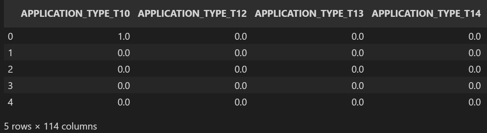

Step 5: Add the original DataFrame’s numerical variables to the DataFrame containing the encoded variables.

The new dataframe should concatenate the categorical variables with the numerical features:

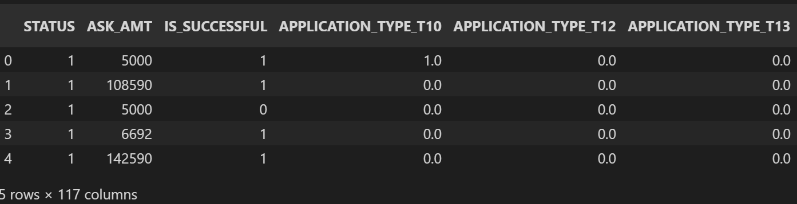

Step 6: Using the preprocessed data, create the features (`X`) and target (`y`) datasets. The target dataset should be defined by the preprocessed DataFrame column “IS_SUCCESSFUL”. The remaining columns should define the features dataset. 

y dataset:

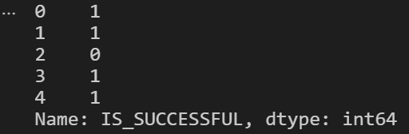

X dataset:

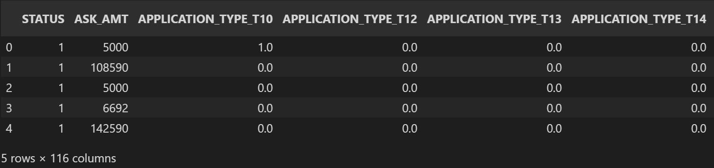

Step 7: Split the features and target sets into training and testing datasets.

```python
# Split the preprocessed data into a training and testing dataset
# Assign the function a random_state equal to 1
X_train, X_test, y_train, y_test = train_test_split(X, y, random_state=1)
```

Step 8: Use scikit-learn's `StandardScaler` to scale the features data.

```python
# Create a StandardScaler instance
scaler = StandardScaler()

# Fit the scaler to the features training dataset
X_scaler = scaler.fit(X_train)

# Fit the scaler to the features training dataset
X_train_scaled = X_scaler.transform(X_train)
X_test_scaled = X_scaler.transform(X_test)
```

Step 9: Create a deep neural network by assigning the number of input features, the number of layers, and the number of neurons on each layer using Tensorflow’s Keras.

The following image shows the structure of our resulting Neural Network:

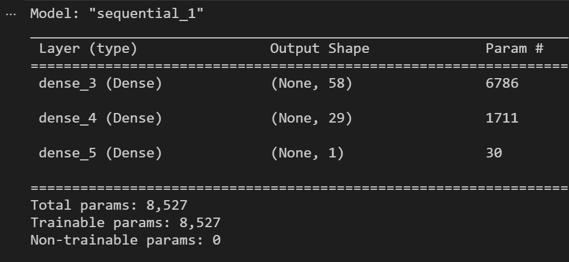

Step 10: Compile and fit the model using the `binary_crossentropy` loss function, the `adam` optimizer, and the `accuracy` evaluation metric.

The following image shows the first few epochs (iterations) of the model training process:

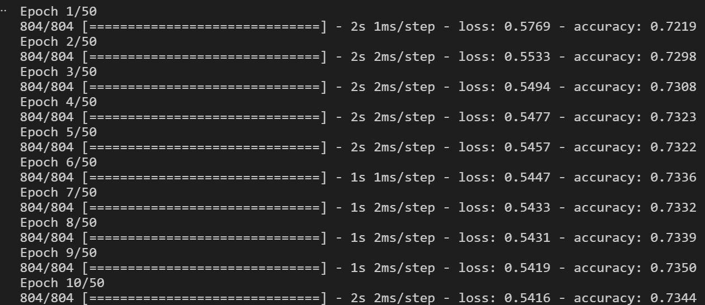

Step 11: Evaluate the model using the test data to determine the model’s loss and accuracy.

The following image displays the evaluation results using out testing data:

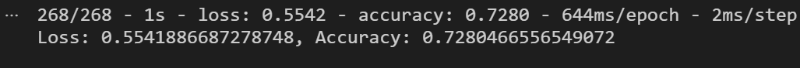

Step 12: Save and export your model to an HDF5 file, and name the file `AlphabetSoup.h5`.

```python
# Set the model's file path
file_path = Path("AlphabetSoup.h5")

# Export your model to a HDF5 file
nn.save(file_path)
```

Step 13: Create Alternative NN Model 1

The following image displays the structure of the first alternative neural network (nn_A1), with 3 hidden layers:

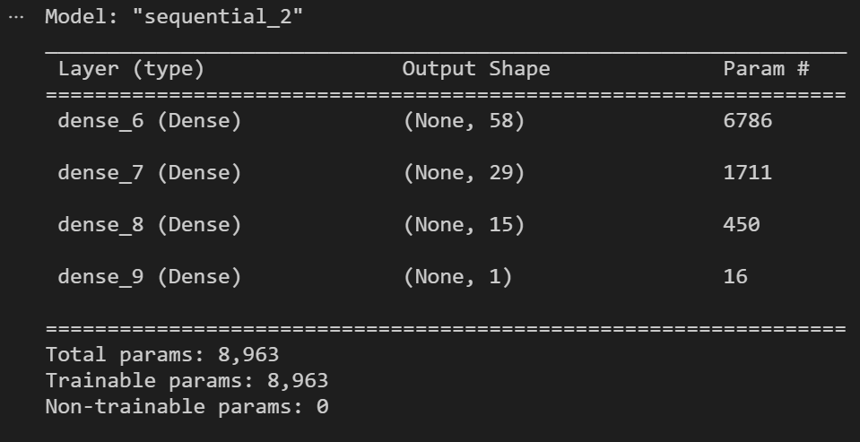

Step 14: Compile and fit the model using the `binary_crossentropy` loss function, the `adam` optimizer, and the `accuracy` evaluation metric.

The following image shows the first few epochs (iterations) of the model training process:


Step 15: Evaluate the model using the test data to determine the model’s loss and accuracy.

The following image displays the evaluation results using out testing data:

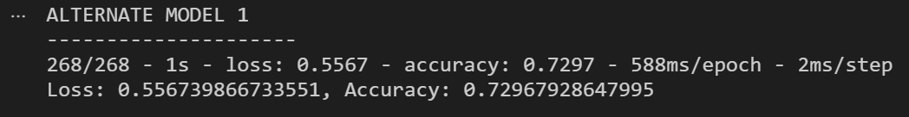

Step 16: Create Alternative NN Model 2

The following image displays the structure of the first alternative neural network (nn_A1), with 2 hidden layers and 100 epochs:

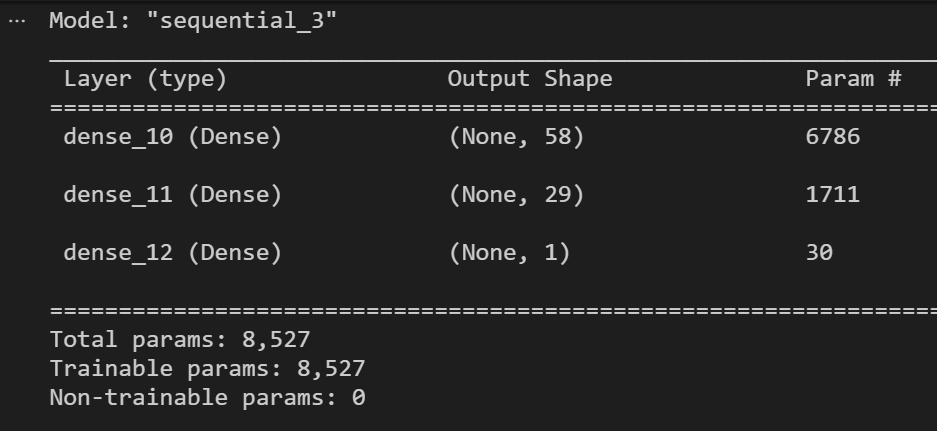

Step 17: Compile and fit the model using the `binary_crossentropy` loss function, the `adam` optimizer, and the `accuracy` evaluation metric.

The following image shows the first few epochs (iterations) of the model training process:

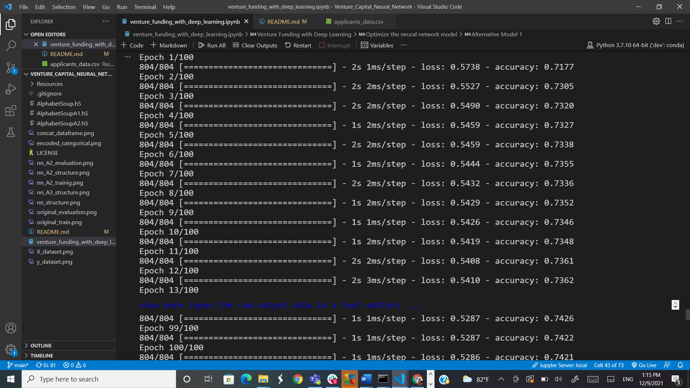

Step 18: Evaluate the model using the test data to determine the model’s loss and accuracy.

The following image displays the evaluation results using out testing data:

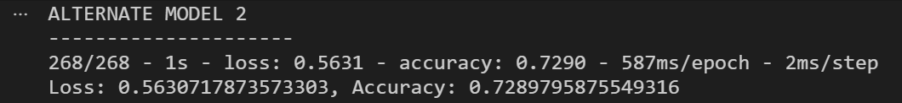

Step 19: Analysis and Comparison of Models

Based on the evaluations, it is clear that the best model to use would be the Original Model. My reasoning behind this is the fact that the original model had an accuracy of 0.7280, the first alternate(nn_A1) returned an accuracy of 0.7297. The final model gave us an accuracy of 0.7290.
While the nn_A1 and nn_A2 did achieve a slightly higher accuracy, the difference is minimal. When the accuracy is similar across models, I will always select the simplest of the models. The original model only had 2 hidden layers and 50 epochs. There is no need to add more complexity to the model since the change is minimal. The original model was the simplest of the 3.  

Step 20: Save each of your alternative models as an HDF5 file.

Save and export AlphabetSoupA1.h5:

```python
# Set the file path for the first alternative model
file_path = Path("AlphabetSoupA1.h5")

# Export your model to a HDF5 file
nn_A1.save(file_path)
```

Save and export AlphabetSoupA2.h5:

```python
# Set the file path for the second alternative model
file_path = Path("AlphabetSoupA2.h5")

# Export your model to a HDF5 file
nn_A2.save(file_path)
```

---

## Contributors

**Created by:** Tony Landero<br>
**Email Adress:** mr.landero@gmail.com